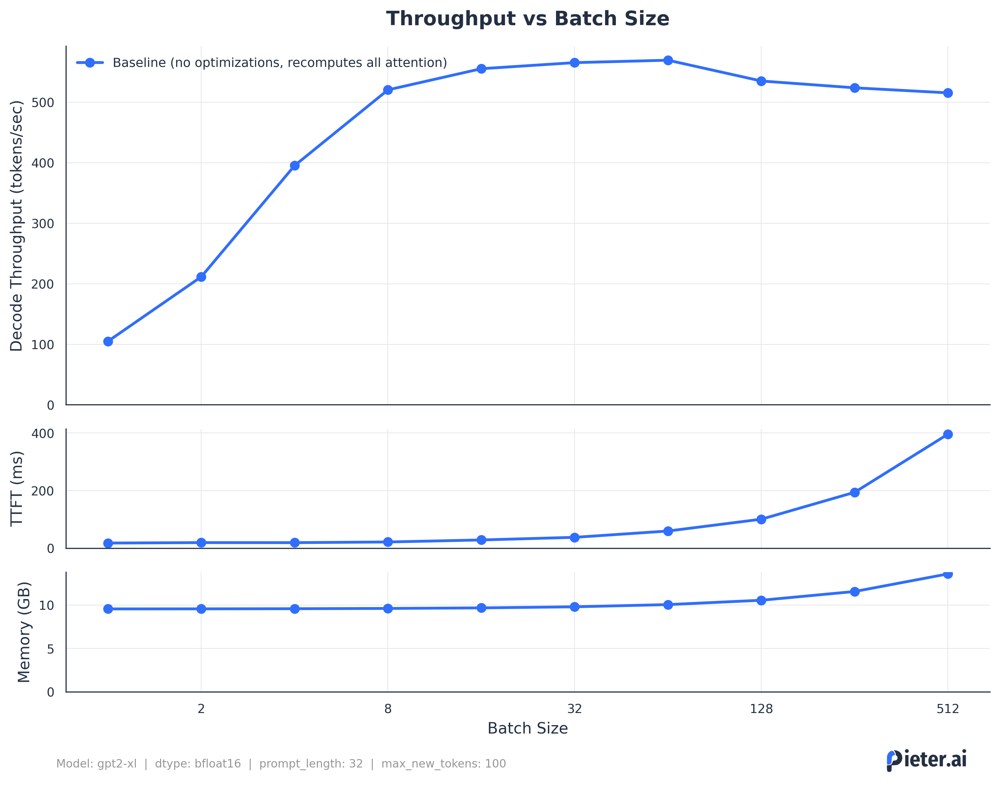
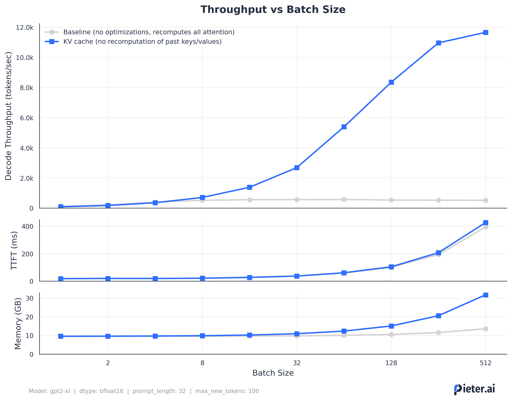
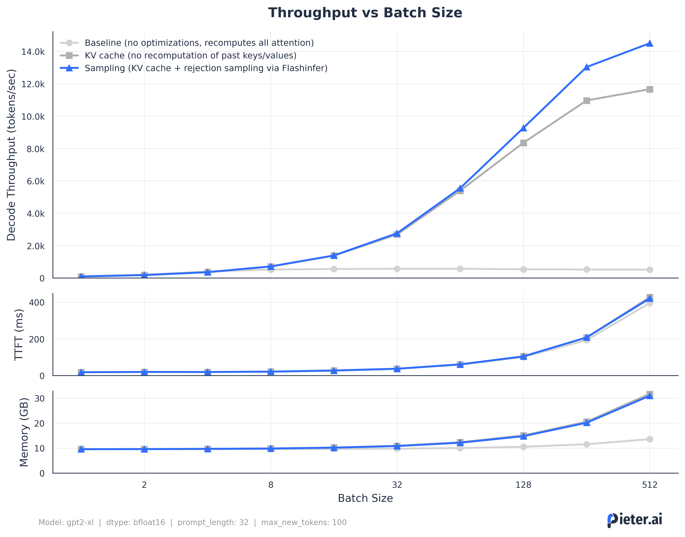
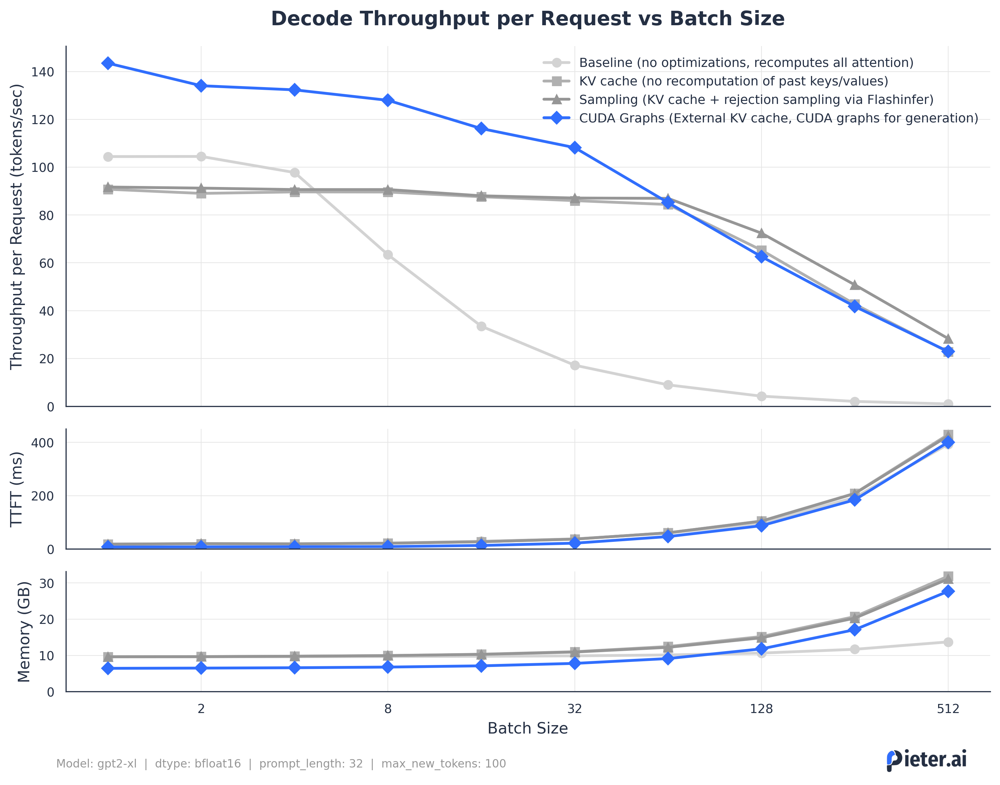

# nanoGPT-inference
This is a WIP repo with some inference optimizations (e.g. KV caching, fused kernels for rejection sampling) in `inference/`. The model implementation itself is a direct fork from [nanoGPT](https://github.com/karpathy/nanoGPT). In the spirit of that repo, the different inference optimizations are mostly focused on education and are more conceptual instead of focused on raw performance (or useability). 

The most intesting aspect is probably the comparative benchmarking, for which you can just run `python benchmark.py --init_from=gpt2-xl --max_new_tokens=100`. 

Using `sample.py`, you can generate some text by specifiying `engine = 'kv_cache'` to verify correctness.

The rest of this readme is focused on the different engines, which you can all run (either with weights or random weights). We use the following metrics:
- **Decode throughput (tokens/sec)**:  Total number of tokens per second during the decode phase, so after the first token. Note that this is not per request, so you need to divide the total number of tokens by the batch size.
- **Time To First Token (ms)**:  Prefill time. Since we care about how long this actually takes for a good experience, I used ms here instead of tokens/sec.
- **VRAM/Memory usage (GB)**: Peak GPU memory usage as observed by `torch.cuda`.

## Baseline


The baseline is the original nanoGPT implementation. It recomputes attention, but does use FlashAttention (if available). As a consequence, we are basically immediately compute-bound.


## KV Caching


By storing our Key and Value outputs from the attention heads, we can save a lot of computations, especially for longer sequence lengths. So now we are no longer compute-bound on the generation phase, yay. 

## Sampling


Naive top-p sampling requires sorting our probabilities (after the softmax). This is not great, because sorting is kinda expensive. [FlashInfer](https://flashinfer.ai/2025/03/10/sampling.html) introduced some kernels for rejection sampling that eliminate sorting by using inverse transform sampling with a pivot instead. On top of that, it's a single kernel so less overhead of launching different kernels for all operations. I just used their implementation, so this was a drop-in replacement for quite some speed gains.

## CUDA Graphs


By capturing the graph of our model during the forward pass, we can eliminate some overhead of launching kernels individually. 

Note that this plot is shows the decode throughput _per request_. Since CUDA graphs are less flexible, we need to capture seperate graphs for each batch size and input shape. We also are less flexible w.r.t. the KV cache, so we use masking tensors instead and pre-allocate the entire KV cache. Since we also transfer those for every forward pass, this adds some overhead that is more pronounced at bigger batch sizes (on an L40S).


# install

```
pip install torch numpy transformers datasets tiktoken wandb tqdm flashinfer-python
```

------

Based on NanoGPT, check out the [original README](https://github.com/karpathy/nanoGPT) for more details on training, data preparation, etc.